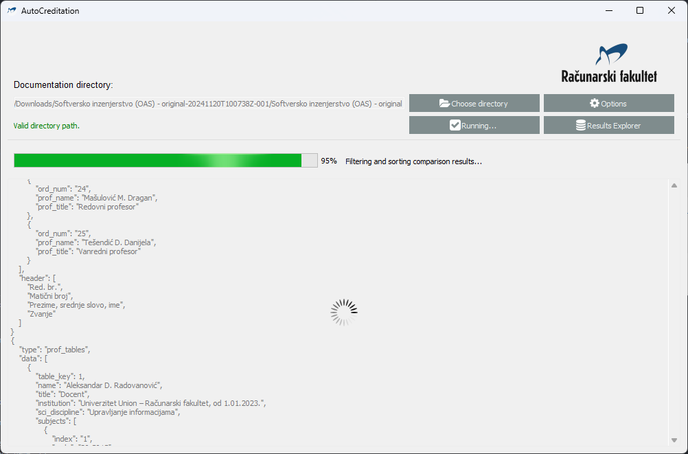

# AutoCreditation

Automated reading and checkup of university acreditation documentation files.

# Overview

 - Converts given documentation files to text and verifies content, confirming that needed documents are and all required information is present.

# Technial details

## Requirements and solutions

 - Documentation content extraction
   - Conversion of .docx to .txt
     - Extraction of text and tables
  - Directory structure scanning
   - Copy of documentation directory is made in a /tmp directory
   - Listing of all files in a given directory
     - Saving paths of all files in a structure
       - To ensure document content reading is possible, some files will be renamed
       - Preserving original file names (directory structure) is done by saving the original file name as well as changed one

# Configuration and startup

## Setting up the environment

### Automatic dependency installation

  To automatically install the required dependencies for this project, run:

  ```bash
  pip install -r requirements.txt
  ```

### Manual dependency installation

  To manually install the required dependencies, install the following packages. To create a conda environment, use the following command:

  ```bash
  conda create -n <env_name>
  ```

  | _DEPENDENCY_ | _PIP_ | _CONDA_ |
  | :----------: | :---: | :-----: |
  | docx | pip install python-docx | conda install conda-forge::python-docx |
  | PyQt5 | pip install PyQt5 | conda install conda-forge::pyqt |
  | pyqtspinner | pip install pyqtspinner | :x: |
  | mammoth | pip install mammoth | conda install auto::mammoth |
  ---


## Running the project

  TODO

## Usage

  ### GUI

  Application can be used by running the `run_app.py` file. GUI is used to select the documentation directory, run the application, and view the results.

  - At the start, path to the documentation directory should be written in the text line, or chosen from the file dialog opend by clicking the "Choose directory" button.
  - If path in the text line is empty, "No documentation directory selected" label is shown in red colour and the "Run" button is disabled.

    

  - If path in the text line is not valid, "Invalid directory path" label is shown in red colour and the "Run" button is disabled.
  - If path in the text line is valid, "Valid directory path" label is shown in green colour and the "Run" button is enabled.

    

  - Clicking the "Run" button starts the application.

    

  - The application run scripts and update the results in the text area.
  - While the application is running, all elements in the main window are disabled. The "Run" button text is changed to "Running...". Spinner is shown over the results text area. Progress bar is displayed, and information about the progress is shown in the status label.

    

  - When the application is finished, all elements in the main window are enabled. The "Run" button text is changed to "Run". Spinner is hidden. Progress bar is hidden. Progress description is hidden. Final results are shown in the results text area.

    

# Changelog

  - 0.0.1 - Project created
    - Initial commit: liscence, readme, project structure
    - Conversion from .docx to .txt
    - Conversion from cyrillic characters to latin characters
    - Updated README.md and requirements.txt
  - 0.0.2 - Directory structure scanning
    - Copy of documentation directory is made in a /tmp directory
    - Listing of all files and folders in a given directory
      - Saving paths of all files in a structure
        - To ensure document content reading is possible, some files may be renamed
        - Preserving original file names (directory structure) is done by saving the original file name as well as changed one
  - 0.0.3 - GUI
    - GUI application for AutoCreditation
      - Main window
      - Documentation directory path
      - Run button
      - Valid directory check label
      - Clean /tmp directory
      - Results and output text area
        - Running spinner
        - Progress bar
        - Progress description
      - Separate thread for running the main application
      - Documentation copying and directory structure reading connected
  - 0.0.4 - GUI, main document and hyperlink verification
    - Main document conversion to .md
      - Conversion of cyrillic characters to latin characters
    - Reading main document
    - Finding hyperlinks to files and directories
    - Verifying hyperlinks paths exist
  - 0.0.5 - GUI, professors file verification
    - Finding professors file in hyperlinks of main document
    - Verifying professors file link
    - Reading professors file
    - Updated README.md
