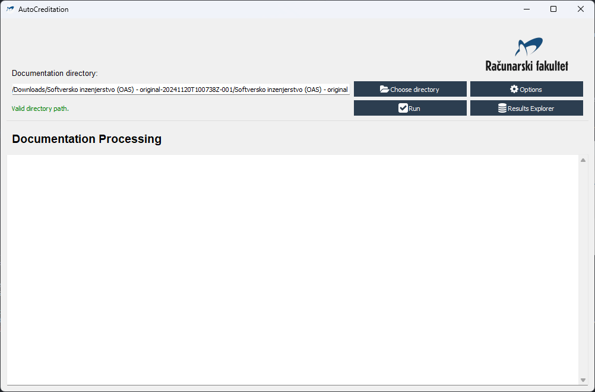
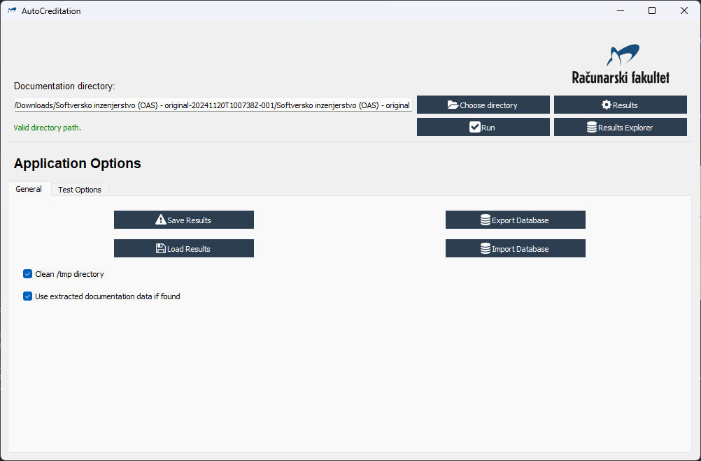
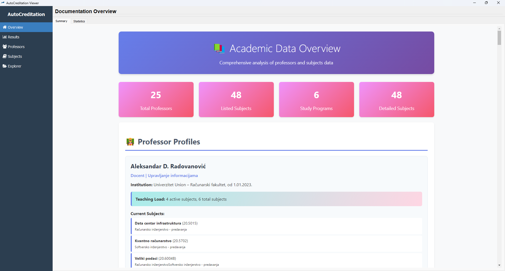
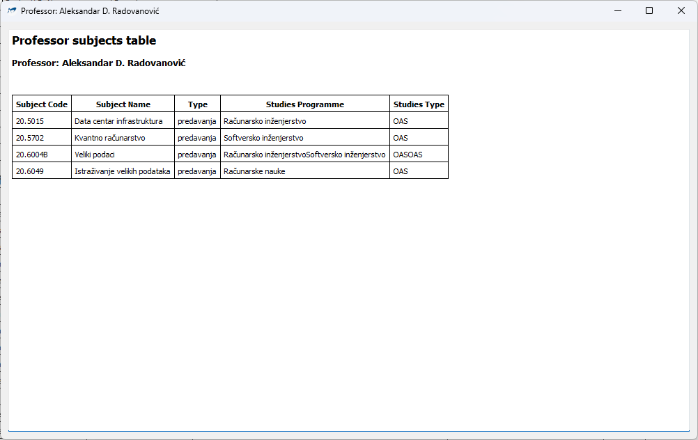
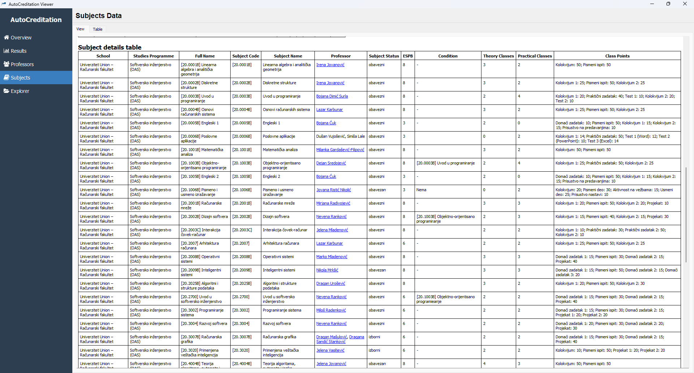

# AutoCreditation

Automated reading and checkup of university acreditation documentation files.

---

# Table of contents

- [AutoCreditation](#autocreditation)
- [Table of contents](#table-of-contents)
- [Overview](#overview)
  - [Features](#features)
  - [System Requirements](#system-requirements)
    - [Windows](#windows)
    - [Linux](#linux)
- [Configuration and startup](#configuration-and-startup)
  - [Setting up the environment](#setting-up-the-environment)
  - [Automatic dependency installation](#automatic-dependency-installation)
  - [Manual dependency installation](#manual-dependency-installation)
- [User Guide](#user-guide)
  - [GUI](#gui)
    - [Main window](#main-window)
      - [Components](#components)
    - [Results Viewer](#results-viewer)
      - [View Categories](#view-categories)
    - [Walkthrough](#walkthrough)
- [Technial details](#technial-details)
  - [Use case diagram](#use-case-diagram)
  - [Component diagram](#component-diagram)
  - [Class diagram](#class-diagram)
  - [Activity diagram - test execution](#activity-diagram---test-execution)
  - [Activity diagram - results viewer navigation](#activity-diagram---results-viewer-navigation)
  - [Sequence diagram - test execution](#sequence-diagram---test-execution)
  - [Sequence diagram - results viewer navigation](#sequence-diagram---results-viewer-navigation)
  - [State diagram](#state-diagram)
  - [Database](#database)
    - [Database diagram](#database-diagram)
    - [Database class structure diagram](#database-class-structure-diagram)
    - [Database conversion diagram](#database-conversion-diagram)
  - [Requirements and solutions](#requirements-and-solutions)
- [Changelog](#changelog)

---

# Overview

AutoCreditation is a desktop application designed to streamline the verification process of university accreditation documentation. It automatically extracts content from documentation files, verifies required information is present, and cross-references data between professors and subjects files to ensure consistency and completeness.

## Features

- **Multi-format Document Support**: Processes .doc, .docx files with automatic conversion
- **Cross-platform Compatibility**: Works on Windows (MS Office Word) and Linux (LibreOffice Writer)
- **Data Extraction**: Extracts text, tables, and hyperlinks from documentation
- **Automated Verification**: Cross-references professor and subject data for consistency
- **Interactive GUI**: User-friendly interface with progress tracking
- **Results Visualization**: HTML-based results display with detailed statistics
- **Data Export/Import**: Save and load verification results and databases
- **File Explorer Integration**: Built-in file browser for documentation navigation

## System Requirements

### Windows

- Windows 10 or later
- Microsoft Office Word (for .doc/.docx conversion)
- Python 3.12+

### Linux

- Ubuntu 18.04+ or equivalent
- LibreOffice Writer (for document conversion)
- Python 3.12+

[Back to top](#autocreditation)

---

# Configuration and startup

## Setting up the environment

- Clone the repository to your local machine

  ```bash
  git clone <repository_url>
  # Set the working directory to the repository
  cd AutoCreditation
  ```

- Create and activate a virtual environment

  ```bash
  # Create a virtual environment
  python -m venv <env_name>

  # Activate the virtual environment
  # Windows
  <env_name>\Scripts\activate
  # Linux
  source <env_name>/bin/activate
  ```

## Automatic dependency installation

  To automatically install the required dependencies for this project, run:

  ```bash
  pip install -r requirements.txt
  ```

## Manual dependency installation

  To manually install the required dependencies, install the following packages. To create a conda environment, use the following command:

  ```bash
  conda create -n <env_name> python=3.12
  ```

  | _DEPENDENCY_ | _PIP_ | _CONDA_ | _CONDITIONS_ |
  | :----------: | :---: | :-----: | :-----------: |
  | docx | pip install python-docx | conda install conda-forge::python-docx | :x: |
  | mammoth | pip install mammoth | conda install auto::mammoth | :x: |
  | PyQtWebEngine | pip install PyQtWebEngine | conda install conda-forge::pyqtwebengine | :x: |
  | PyQt5 | pip install PyQt5 | conda install conda-forge::pyqt | :x: |
  | pyqtspinner | pip install pyqtspinner | :x: | :x: |
  | pandas | pip install pandas | conda install anaconda::pandas | :x: |
  | ujson | pip install ujson | conda install anaconda::ujson | :x: |
  | pywin32 | pip install pywin32 | conda install anaconda::pywin32 | Windows only |


[Back to top](#autocreditation)

---

# User Guide

Graphical user interface (GUI) allows user-friendly interaction with the application.

## GUI

Application can be used by running the `run_app.py` file. GUI is used to select the documentation directory, run the application, and view the results.

### Main window

#### Components

- **Documentation Directory Path**: Text input for specifying the path to your accreditation documentation
- **Choose Directory Button**: Opens file explorer to locate documentation folder
- **Options Button**: Reveals configuration tabs:

  - General Options:

    - Load/Save results with success/failure notifications
    - Import/Export database functionality
    - Clear /tmp directory on test start
    - Reuse previously extracted data (speeds up repeated tests)

  - Test Options:

    - Enable/disable professor-subject table comparison (always enabled)
    - Set minimum number of subjects per professor
    - Enable class points sum verification (should equal 100)

- **Run Button**: Initiates the verification process (disabled until valid path is provided)
- **Results Viewer Button**: Opens the results exploration window

- **Status Indicators**

  - Path Validation:

    - Red "Invalid directory path" - when path doesn't exist
    - Green "Valid directory path" - when path is valid and Run button becomes enabled

  - Progress Tracking: During test execution, displays progress bar, spinner, and status updates

### Results Viewer

A comprehensive interface for exploring verification results and extracted data:

#### View Categories

- **Overview**

  - Data Overview: Summary statistics (professor count, subject count, etc.)
  - Statistics Overview: Detailed analytics about the documentation

- **Results**

  - Results Display: HTML-formatted verification results
  - Documentation Tree: Visual representation of the documentation structure

- **Professor Data**

  - Data View: Interactive HTML tables with clickable links to subject details
  - Table Viewer: Raw database view of professor information

- **Subjects Data**

  - Data View: Interactive HTML tables for subject information with clickable links to professor details
  - Table Viewer: Raw database view of subject data

- **File Explorer**

  - Root Path Selection: Choose starting directory for exploration
  - Integrated Browser: Navigate through documentation files within the application

### Walkthrough

- At the start, path to the documentation directory should be written in the text line, or chosen from the file dialog opend by clicking the "Choose directory" button.
- If path in the text line is empty, "No documentation directory selected" label is shown in red colour and the "Run" button is disabled.

  

- If path in the text line is valid, "Valid directory path" label is shown in green colour and the "Run" button is enabled.

  

- Options button switches to the options view with two tabs:
  - *General* tab with basic options
    - Clearing */tmp* directory at the start of the application
    - Using extracted documentation data if found (skipping conversion and extraction)
    - Saving/Loading results (JSON file) and Exporting/Importing database

      

  - *Test Options* tab with data testing/verification options
    - Comparing professors and subjects data (finding mismatched items in professors and subjects tables)
    - Verifying professors have at least minimum number of subjects (with minimum number of subjects set)
    - Verifying class points sum is equal to 100

      

- Clicking the "Run" button starts the application.

- The application run scripts and update the results in the text area.
- While the application is running, all elements in the main window are disabled. The "Run" button text is changed to "Running...". Spinner is shown over the results text area. Progress bar is displayed, and information about the progress is shown in the status label.

  

- When the application is finished, all elements in the main window are enabled. The "Run" button text is changed to "Run". Spinner is hidden. Progress bar is hidden. Progress description is hidden.
- Final results are shown in the results explorer window automatically opened at the end of test execution.
- This window has 5 views selected in the sidebar:
  - **Overview**: Summary of the documentation data and statistical analysis, each in a separate tab

    

    

  - **Results**: Results of the test execution and documentation tree, each in a separate tab

    

    

  - **Professors**: List of professors and professor tables (as HTML), with subjects displayed upon clicking on a *Subjects* link (Table is displayed in a separate window);

    

    

    and database viewer of professors data (with search/filter functionality)

    

  - **Subjects**: List of subjects and subject tables (as HTML), with professors displayed upon clicking on a professor link (Table is displayed in a separate window);

    

    and database viewer of subjects data (with search/filter functionality)

    

  - **Explorer**: File explorer with adjustable root directory

    


[Back to top](#autocreditation)

---

# Technial details

## Use case diagram


## Component diagram


## Class diagram


## Activity diagram - test execution


## Activity diagram - results viewer navigation


## Sequence diagram - test execution


## Sequence diagram - results viewer navigation


## State diagram


## Database

### Database diagram


### Database class structure diagram


### Database conversion diagram


## Requirements and solutions

- Documentation content extraction
  - Conversion of .doc to .docx
    - Platform specific conversion
      - Windows: MS Office Word
        - Additional Python package (pywin32) is required and is installed automatically
      - Linux: LibreOffice Writer
      - Word/Writer is called, with file path and output path
  - Conversion of .docx to .html
    - .docx is converted to .html using Mammoth package
      - With converted file, data extraction is possible:
      - Extraction of text and tables
      - Extraction of hyperlinks
        - Verification of hyperlinks paths
  - Directory structure scanning
    - Copy of documentation directory is made in a /tmp directory
      - Listing of all files in a given directory
      - Saving paths of all files in a structure
      - To ensure document content reading is possible, files are renamed so that all non-latin characters are replaced with latin characters
  - Finding files using found hyperlinks
    - Files with content that needs to be tested are located using hyperlinks, which are paths to those files
    - Found files are converted as stated above
  - Tables from converted files are read using pandas
    - Data from tables is structured into dictionaries
- Professors file and subjects file comparison
  - Subjects for each professor are listed in the professors file
  - Professor is named for each subject in the subjects file
  - For each professor, subjects are compared to subjects in the subjects file
    - If subject is not found in the subjects file, professor-subject is added to the list of unmatched items
    - If subject is found in the subjects file, but professor name is not matching, item is added to the list of potential matches, marked as "prof_name_mismatch"
    - If subject is found in the subjects file, but subject name is not matching, item is added to the list of potential matches, marked as "subj_name_mismatch"
- Comparison results are filtered
  - Comparison results are filtered so only subjects of the studies programme for which the processed documentation is written are listed
  - Professors to subjects comparison results are filtered into 3 categories formed by:
    - Finding items with no matching subject (no subject with matching subject code)
    - Finding items where professor name is not matching (subject code is matching, but professor name is not matching)
    - Finding items where subject name is not matching (subject code is matching, but subject name is not matching)
  - Subjects to professors comparison results are filtered into 3 categories formed by:
    - Finding items with no matching professor (no professor with current subject listed in the subjects list)
    - Finding items where professor name is not matching (subject found in the subjects list of a professor, but professor name is not matching)
    - Finding items where subject name is not matching (subject found in the subjects list of a professor, but subject name is not matching)
- Data/Results saving and loading
  - Results and professor/subjects data are saved as a JSON file
  - Extracted data (professors and subjects data) is saved in a SQLite database
  - Both results JSON and database can be imported and exported
    - Automatic conversion of JSON to database and vice versa
    - Professor/subject data is extracted from imported save file
- HTML generation
  - Results are displayed in HTML format
  - HTML tables are generated for professors and subjects data, with clickable links to subjects/professors data
  - Database content is displayed in *Table* tabs of *Professors* and *Subjects* views of Results Explorer
  - Data overview and statistics are displayed in *Overview* view of Results Explorer
    - Content is loaded into styled HTML
- File explorer is integrated into the application, with root directory selection

[Back to top](#autocreditation)

---

# Changelog

  - 0.0.1 - Project created
    - Initial commit: liscence, readme, project structure
    - Conversion from .docx to .txt
    - Conversion from cyrillic characters to latin characters
    - Updated README.md and requirements.txt
  - 0.0.2 - Directory structure scanning
    - Copy of documentation directory is made in a /tmp directory
    - Listing of all files and folders in a given directory
      - Saving paths of all files in a structure
        - To ensure document content reading is possible, some files may be renamed
        - Preserving original file names (directory structure) is done by saving the original file name as well as changed one
  - 0.0.3 - GUI
    - GUI application for AutoCreditation
      - Main window
      - Documentation directory path
      - Run button
      - Valid directory check label
      - Clean /tmp directory
      - Results and output text area
        - Running spinner
        - Progress bar
        - Progress description
      - Separate thread for running the main application
      - Documentation copying and directory structure reading connected
  - 0.0.4 - GUI, main document and hyperlink verification
    - Main document conversion to .md
      - Conversion of cyrillic characters to latin characters
    - Reading main document
    - Finding hyperlinks to files and directories
    - Verifying hyperlinks paths exist
  - 0.0.5 - GUI, professors file verification
    - Finding professors file in hyperlinks of main document
    - Verifying professors file link
    - Reading professors file
    - Updated README.md
  - 0.0.6 - Linux support
    - Added support for Linux
      - Converting .doc files to .docx using LibreOffice
    - .docx to .html conversion
      - Files are converted to .html instead of .md
      - File reading support for .html files
      - Extracting hyperlinks from .html files
      - Absolute and relative paths in hyperlinks supported
    - Renaming files while reading directory structure
      - Replacing cyrillic characters with latin characters in files/directories names
  - 0.0.7 - Reading professors file
    - .html file is loaded, separated into tables
    - Tables are read using pandas
      - List of professors is extracted from the first table
      - Each professor data is extracted from other tables
    - Extracted professors data is saved to a file
    - Subjects file
      - File is found, converted to .docx and then to .html
  - 0.0.8 - Reading subjects file
    - .html file is loaded, separated into tables
    - Tables are read using pandas
      - List of subjects is extracted from the first table
      - Each subject data is extracted from other tables
    - Extracted subjects data is saved to a file
  - 0.0.9 - Comparison of professors and subjects data
    - Comparison of professors and subjects data
      - 2 comparisons are made:
        1. Professors to subjects
          - List of subjects for the given professors is iterated
          - Each subject is searched for in the subjects file (table)
          - Subjects are matched by the subject code
          - If no matching subject is found, professor-subject is added to the list of unmatched items
          - If subject code is matching, but professor name is not matching, item is added to the list of potential matches, marked as "prof_name_mismatch"
          - If subject code is matching, but subject name is not matching, item is added to the list of potential matches, marked as "subj_name_mismatch"
        2. Subjects to professors
          - List of professors is iterated, for each professor subjects list is checked to find matching subject (by code)
          - If professor is not found, item is added to the list of unmatched items
          - If professor is found, but professor name is not matching, item is added to the list of potential matches, marked as "prof_name_mismatch"
          - If professor is found, but subject name is not matching, item is added to the list of potential matches, marked as "subj_name_mismatch"
  - 0.0.10 - Filtering and sorting comparison results
     - Professors to subjects comparison results filtering
       - Finding items with no matching subject
       - Finding items where professor name is not matching
       - Finding items where subject name is not matching
     - Subjects to professors comparison results filtering
       - Finding items with no matching professor
       - Finding items where professor name is not matching
       - Finding items where subject name is not matching
  - 0.1.0 - Results and tables display
    - Options panel of the main window, results and data in explorer window
    - Results HTML generation, as well as tables for professors and subjects
    - All subjects of a professor preview window
    - Data/.JSON saving and loading
    - Loading previous results and data, saving current results and data
  - 0.1.0 - Additional data checks
    - Testing if professors have at least minimum number of subjects (set in gui)
    - Testing if class points sum is equal to 100 (set in gui) for subjects
    - Moved pywin32 package installation to requirements.txt as conditional
  - 0.2.0 - Full functionality and README
    - Application fully functional, tested and documented
    - README.md updated

[Back to top](#autocreditation)

---