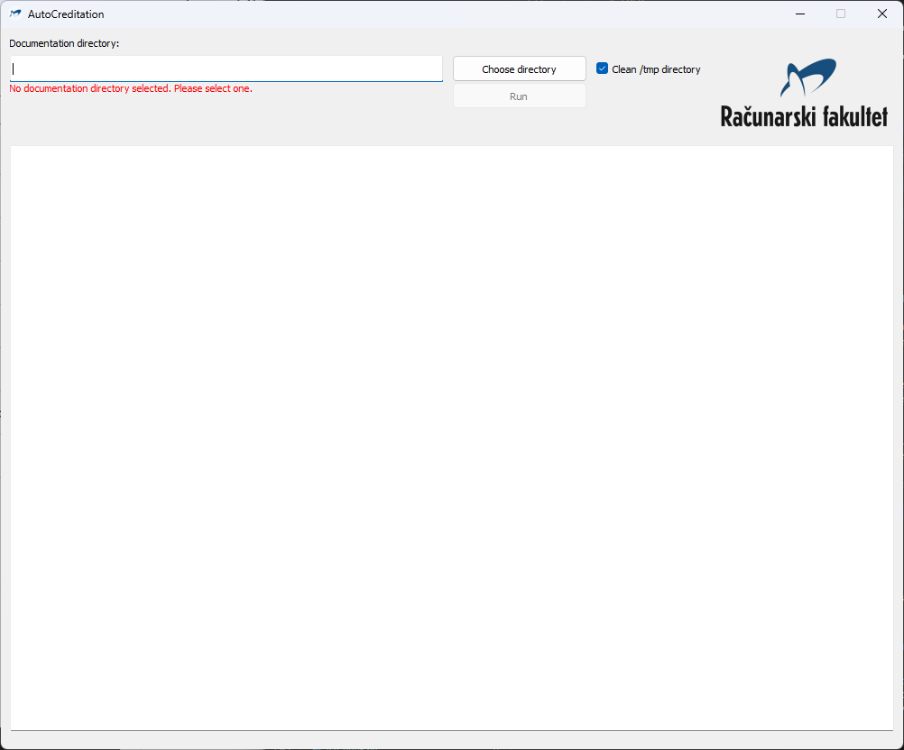
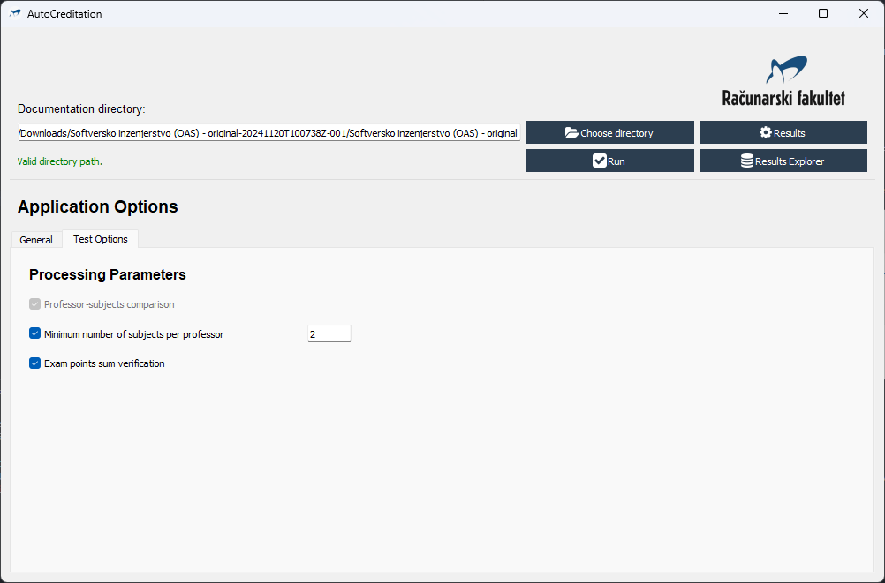

# AutoCreditation

Automated reading and checkup of university acreditation documentation files.

# Overview

 - Converts given documentation files to text and verifies content, confirming that needed documents are and all required information is present.
 - Supported operating systems:
   - Windows (with MS Office Word installed)
   - Linux (with LibreOffice Writer installed)

# Technial details

## Requirements and solutions

 - Documentation content extraction
   - Conversion of .doc to .docx
     - Platform specific conversion
       - Windows: MS Office Word
         - Additional Python package (pywin32) is required and is installed automatically
       - Linux: LibreOffice Writer
       - Word/Writer is called, with file path and output path
   - Conversion of .docx to .html
     - .docx is converted to .html using Mammoth package
     - With converted file, data extraction is possible:
       - Extraction of text and tables
       - Extraction of hyperlinks
         - Verification of hyperlinks paths
  - Directory structure scanning
   - Copy of documentation directory is made in a /tmp directory
   - Listing of all files in a given directory
     - Saving paths of all files in a structure
       - To ensure document content reading is possible, files are renamed so that all non-latin characters are replaced with latin characters
  - Finding files using found hyperlinks
    - Files with content that needs to be tested are located using hyperlinks, which are paths to those files
    - Found files are converted as stated above
  - Tables from converted files are read using pandas
    - Data from tables is structured into dictionaries
  - Professors file and subjects file comparison
    - Subjects for each professor are listed in the professors file
    - Professor is named for each subject in the subjects file
    - For each professor, subjects are compared to subjects in the subjects file
      - If subject is not found in the subjects file, professor-subject is added to the list of unmatched items
      - If subject is found in the subjects file, but professor name is not matching, item is added to the list of potential matches, marked as "prof_name_mismatch"
      - If subject is found in the subjects file, but subject name is not matching, item is added to the list of potential matches, marked as "subj_name_mismatch"
  - Comparison results are filtered
    - Comparison results are filtered so only subjects of the studies programme for which the processed documentation is written are listed
    - Professors to subjects comparison results are filtered into 3 categories formed by:
      - Finding items with no matching subject (no subject with matching subject code)
      - Finding items where professor name is not matching (subject code is matching, but professor name is not matching)
      - Finding items where subject name is not matching (subject code is matching, but subject name is not matching)
    - Subjects to professors comparison results are filtered into 3 categories formed by:
      - Finding items with no matching professor (no professor with current subject listed in the subjects list)
      - Finding items where professor name is not matching (subject found in the subjects list of a professor, but professor name is not matching)
      - Finding items where subject name is not matching (subject found in the subjects list of a professor, but subject name is not matching)

# Configuration and startup

## Setting up the environment

### Automatic dependency installation

  To automatically install the required dependencies for this project, run:

  ```bash
  pip install -r requirements.txt
  ```

### Manual dependency installation

  To manually install the required dependencies, install the following packages. To create a conda environment, use the following command:

  ```bash
  conda create -n <env_name> python=3.12
  ```

  | _DEPENDENCY_ | _PIP_ | _CONDA_ |
  | :----------: | :---: | :-----: |
  | docx | pip install python-docx | conda install conda-forge::python-docx |
  | PyQt5 | pip install PyQt5 | conda install conda-forge::pyqt |
  | pyqtspinner | pip install pyqtspinner | :x: |
  | mammoth | pip install mammoth | conda install auto::mammoth |
  | pandas | pip install pandas | conda install anaconda::pandas |
  ---


## Running the project

  TODO

## Usage

  Graphical user interface (GUI) allows user-friendly interaction with the application.

  ### GUI

  Application can be used by running the `run_app.py` file. GUI is used to select the documentation directory, run the application, and view the results.

  - At the start, path to the documentation directory should be written in the text line, or chosen from the file dialog opend by clicking the "Choose directory" button.
  - If path in the text line is empty, "No documentation directory selected" label is shown in red colour and the "Run" button is disabled.

    

  - If path in the text line is not valid, "Invalid directory path" label is shown in red colour and the "Run" button is disabled.
  - If path in the text line is valid, "Valid directory path" label is shown in green colour and the "Run" button is enabled.

    

  - Clicking the "Run" button starts the application.

    

  - The application run scripts and update the results in the text area.
  - While the application is running, all elements in the main window are disabled. The "Run" button text is changed to "Running...". Spinner is shown over the results text area. Progress bar is displayed, and information about the progress is shown in the status label.

    

  - When the application is finished, all elements in the main window are enabled. The "Run" button text is changed to "Run". Spinner is hidden. Progress bar is hidden. Progress description is hidden. Final results are shown in the results text area.

    

# Changelog

  - 0.0.1 - Project created
    - Initial commit: liscence, readme, project structure
    - Conversion from .docx to .txt
    - Conversion from cyrillic characters to latin characters
    - Updated README.md and requirements.txt
  - 0.0.2 - Directory structure scanning
    - Copy of documentation directory is made in a /tmp directory
    - Listing of all files and folders in a given directory
      - Saving paths of all files in a structure
        - To ensure document content reading is possible, some files may be renamed
        - Preserving original file names (directory structure) is done by saving the original file name as well as changed one
  - 0.0.3 - GUI
    - GUI application for AutoCreditation
      - Main window
      - Documentation directory path
      - Run button
      - Valid directory check label
      - Clean /tmp directory
      - Results and output text area
        - Running spinner
        - Progress bar
        - Progress description
      - Separate thread for running the main application
      - Documentation copying and directory structure reading connected
  - 0.0.4 - GUI, main document and hyperlink verification
    - Main document conversion to .md
      - Conversion of cyrillic characters to latin characters
    - Reading main document
    - Finding hyperlinks to files and directories
    - Verifying hyperlinks paths exist
  - 0.0.5 - GUI, professors file verification
    - Finding professors file in hyperlinks of main document
    - Verifying professors file link
    - Reading professors file
    - Updated README.md
  - 0.0.6 - Linux support
    - Added support for Linux
      - Converting .doc files to .docx using LibreOffice
    - .docx to .html conversion
      - Files are converted to .html instead of .md
      - File reading support for .html files
      - Extracting hyperlinks from .html files
      - Absolute and relative paths in hyperlinks supported
    - Renaming files while reading directory structure
      - Replacing cyrillic characters with latin characters in files/directories names
  - 0.0.7 - Reading professors file
    - .html file is loaded, separated into tables
    - Tables are read using pandas
      - List of professors is extracted from the first table
      - Each professor data is extracted from other tables
    - Extracted professors data is saved to a file
    - Subjects file
      - File is found, converted to .docx and then to .html
  - 0.0.8 - Reading subjects file
    - .html file is loaded, separated into tables
    - Tables are read using pandas
      - List of subjects is extracted from the first table
      - Each subject data is extracted from other tables
    - Extracted subjects data is saved to a file
  - 0.0.9 - Comparison of professors and subjects data
    - Comparison of professors and subjects data
      - 2 comparisons are made:
        1. Professors to subjects
          - List of subjects for the given professors is iterated
          - Each subject is searched for in the subjects file (table)
          - Subjects are matched by the subject code
          - If no matching subject is found, professor-subject is added to the list of unmatched items
          - If subject code is matching, but professor name is not matching, item is added to the list of potential matches, marked as "prof_name_mismatch"
          - If subject code is matching, but subject name is not matching, item is added to the list of potential matches, marked as "subj_name_mismatch"
        2. Subjects to professors
          - List of professors is iterated, for each professor subjects list is checked to find matching subject (by code)
          - If professor is not found, item is added to the list of unmatched items
          - If professor is found, but professor name is not matching, item is added to the list of potential matches, marked as "prof_name_mismatch"
          - If professor is found, but subject name is not matching, item is added to the list of potential matches, marked as "subj_name_mismatch"
   - 0.0.10 - Filtering and sorting comparison results
     - Professors to subjects comparison results filtering
       - Finding items with no matching subject
       - Finding items where professor name is not matching
       - Finding items where subject name is not matching
     - Subjects to professors comparison results filtering
       - Finding items with no matching professor
       - Finding items where professor name is not matching
       - Finding items where subject name is not matching
